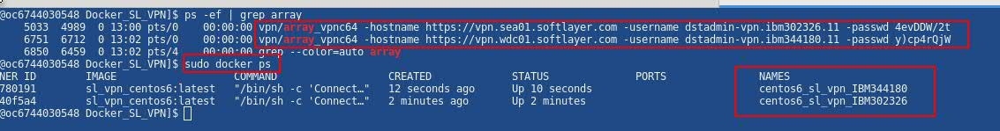

# Create container for SL VPN

## Build image

sudo docker build -t sl_vpn_centos6 --file Dockerfile_centos6_sl_vpn .

## Create User_Password.cr file and add your IBM credentials

### Use the format:

User:ocervant@mx1.ibm.com

Password:MySuperSecretPassword

## Create, run and attach to the container

./Start_SLVPN_Container.sh Account #For example IBM302326

### It will start and attach to the container with the VPN connection started, you can start as many containers you want with connection to a different account VPN

### You can check the VPN connections on the host:

## Additionally once connected to the container you will be able to use the scripts:

### To connecto to the VPN

Connection.sh ocervant.278462 'Mypassword' 

### To close the VPN connection

CloseVPN.sh

### You will be able to run vncviewer and xfreerdp from inside the container 

## If something failed, you can clean your docker environment using:

sudo docker stop $(sudo docker ps -a -q) && sudo docker rm $(sudo docker ps -a -q)

